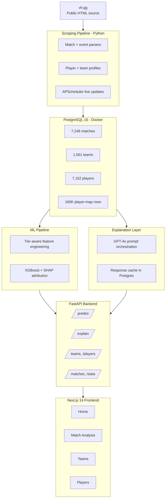

# VLR Analytics — System Architecture

**Project:** Explainable win prediction for Valorant esports
**Author:** Karan Mhaswadkar (km14@kent.ac.uk)
**Supervisor:** Sergey Ovchinnik
**Programme:** MSc Computer Science (AI with Industry Placement), University of Kent

---

## 1. Overview

VLR Analytics is a full-stack esports analytics platform that predicts Valorant match outcomes and generates natural-language explanations of what drove each result. It extends the critical review of García-Méndez & de Arriba-Pérez (2025) — "Explainable e-sports Win Prediction through ML Classification in Streaming" — by addressing three gaps identified in that paper:

1. **No player/team-form modelling** → we implement tier-aware rolling form features.
2. **Feature-level explanations only** → we translate SHAP attributions into GPT-4o-generated coaching-ready prose.
3. **Single-game scope (CS:GO only)** → we apply the same architectural pattern to Valorant, a game where positional demo data is deliberately not published.

---

## 2. Architecture Diagram



---

## 3. Layer-by-Layer Breakdown

### 3.1 Data Source — vlr.gg

vlr.gg is the community-maintained match database for professional Valorant. It is the **only publicly accessible source** of pro-match statistics because Riot Games:

- Does not publish demo files (unlike CS:GO's public GOTV demos).
- Restricts its official esports API to approved partners under NDA.

This constraint is itself a research contribution to discuss in the dissertation — it explains why the Valorant analytics ecosystem is significantly less mature than CS:GO's, and why HTML scraping remains the state of the art.

### 3.2 Scraping Pipeline — `src/vlr/scraping/`

Modular scraper with clear separation of concerns:

| Module | Responsibility |
|---|---|
| `client.py` | HTTP layer with 2-second global throttle, exponential backoff via `tenacity`, custom User-Agent identifying the dissertation project |
| `parsers.py` | HTML → dataclass parsers using `BeautifulSoup4`. Defensive selectors that try multiple patterns and return `None` gracefully on failure |
| `pipeline.py` | Orchestration: fetch listing → dedupe → fetch details → persist. Includes resumable backfills for player photos and team logos |

**Live updates:** `APScheduler` runs a background task every 30 minutes to poll `/matches/results` for newly completed matches. Configurable via `LIVE_SCRAPE_ENABLED` and `LIVE_SCRAPE_INTERVAL_MIN` environment variables.

### 3.3 Database — `src/vlr/db/`

**PostgreSQL 16** running in Docker via `docker-compose`. Chosen over SQLite for concurrent scheduler+API writes and JSONB support.

**SQLAlchemy 2** ORM with typed `Mapped[]` columns provides both compile-time type checking and runtime schema validation.

**Custom lightweight migration system:** a `_MIGRATIONS` list of `(name, sql)` tuples in `session.py` runs idempotent `ALTER TABLE ... ADD COLUMN IF NOT EXISTS` statements on `init-db`. This avoids the overhead of Alembic for a project where schema changes are rare and always additive.

**Schema design principle:** vlr.gg's own IDs (`match_id`, `team_id`, `player_id`) are used as primary keys, making scrapes fully idempotent — re-running the scraper never creates duplicates, only updates.

**Current dataset:**

| Entity | Count |
|---|---|
| Matches | 7,248 |
| Teams (with logos + countries) | 1,561 |
| Players (with photos + countries + real names) | 7,152 |
| Events | 167 |
| Maps played | 16,078 |
| Player-map stat rows | 160,284 |
| Veto actions | 24,551 |

Time window: Tier-1 + Challengers matches since 2024.

### 3.4 ML Pipeline — `src/vlr/ml/`

**`scikit-learn`** for preprocessing pipelines and evaluation metrics.
**`XGBoost`** for the gradient-boosted decision tree classifier (win probability, binary target).
**`SHAP`** for feature attribution.
**`pandas` / `numpy`** for feature engineering.

**Distinctive contribution — tier-aware features (`tiers.py`):**

The García-Méndez paper reports 92.5% accuracy on CS:GO but is likely affected by temporal leakage — training data contaminates test data when features leak information about future matches. Our approach addresses this by:

1. Classifying every event into `international | tier1 | tier2` via regex on event names.
2. Computing rolling-form features (win rate, avg rating, ACS trend) **relative to opponent tier** rather than absolute.
3. Warning the user when a prediction crosses tiers (e.g. training data is mostly tier-1 but the matchup is tier-2 vs international) — an honest UI signal about model confidence out-of-distribution.

Trained model artefact: `data/models/xgboost_v1.pkl`.

### 3.5 Explanation Layer — `src/vlr/ml/explain.py`, `attribution.py`

**OpenAI GPT-4o** converts SHAP attribution values into structured natural-language output.

Pipeline for a single match:
1. Compute SHAP values for the losing team's feature vector (`attribution.py`).
2. Rank features by absolute SHAP magnitude.
3. Enrich with contextual data (player standouts/underperformers from `player_map_stats`).
4. Format as a structured prompt with the top factors, player context, and match metadata.
5. Call `gpt-4o` with a system prompt instructing coaching-analyst voice.
6. Parse JSON response into `summary`, `key_factors[]`, `standout_players[]`, `underperformers[]`.
7. Cache the response in `match_analysis_cache` table keyed by `(match_id, model_version)`.

**Why this is a contribution over the reviewed paper:** García-Méndez et al. stop at "feature X had importance Y". Our layer produces sentences like *"the primary factor was Player A's below-average ACS on defence rounds combined with Team B's superior early-round win rate on Bind"*. This is what an analyst or coach would actually read.

Cache-first design keeps the OpenAI bill bounded — a re-view of any previously analyzed match is a Postgres lookup, not a fresh API call.

### 3.6 Backend API — `src/vlr/api/`

**FastAPI** on **Uvicorn** ASGI server.

| Component | Purpose |
|---|---|
| `main.py` | App factory, CORS middleware, scheduler startup/shutdown hooks |
| `limits.py` | `slowapi` rate limiter (extracted here to break circular imports) |
| `scheduler.py` | Background live-scrape job (30-min interval) |
| `schemas.py` | Pydantic v2 request/response models with strict validation |
| `routes/` | Domain-split routers: matches, teams, players, predict, explain, stats |

**Auto-generated OpenAPI documentation** at `/docs`.
**Per-IP rate limiting** protects the OpenAI cost surface — the `/explain` endpoint is the primary target.

### 3.7 Frontend — `web/`

**Next.js 14** with the App Router, **TypeScript** throughout.

Design language: hybrid of Linear's calm neutral base, Vercel's precise typography, and moments of Oxlo's hero styling. Dark theme with a warm red accent (`#FA4454`).

| Library | Use |
|---|---|
| Tailwind CSS | Utility styling with a custom design-token config |
| Framer Motion | Fade-in, fade-up, scale-in transitions; animated stat counters; probability-bar fills |
| Recharts | Player form line-charts on the Players page |
| lucide-react | Icon set (arrows, chevrons, sparkles) |

**Pages:**

| Route | Purpose |
|---|---|
| `/` | Hero + latest results feed + tool cards |
| `/predict` | Team A vs Team B selector → win probability with animated bars |
| `/match-analysis` | Tier filter → match selector → AI-generated breakdown |
| `/teams` | Regional leaderboard (bo3.gg-style) with logos, flags, roster preview |
| `/players` | Regional team grid → roster cards (HLTV-style with photos + country flags) → player stats |

---

## 4. Complete Tech Stack

| Layer | Technologies |
|---|---|
| Backend language | Python 3.13 |
| Frontend language | TypeScript |
| Scraping | requests, BeautifulSoup4, tenacity, APScheduler |
| Database | PostgreSQL 16, SQLAlchemy 2, Docker Compose |
| ML | XGBoost, scikit-learn, SHAP, pandas, numpy |
| LLM | OpenAI API (`gpt-4o`) |
| Backend framework | FastAPI, Uvicorn, Pydantic v2, slowapi |
| Frontend framework | Next.js 14, React 18, TypeScript |
| Frontend styling | Tailwind CSS, Framer Motion, lucide-react, Recharts |
| CLI + tooling | Typer, Rich (terminal UI), python-dotenv |
| Legacy prototype (kept alongside) | Streamlit |

---

## 5. Repository Structure

```
vlr-analytics/
├── docker-compose.yml           # Postgres container
├── requirements.txt             # Python dependencies
├── .env                         # Local secrets (OPENAI_API_KEY, DB_URL)
├── data/
│   └── models/xgboost_v1.pkl   # Trained model artefact
├── scripts/
│   ├── run_api.sh              # FastAPI + Uvicorn entrypoint
│   └── run_app.sh              # Streamlit legacy entrypoint
├── src/vlr/
│   ├── config.py               # Pydantic Settings for env vars
│   ├── cli.py                  # Typer CLI (scraping, backfills, training, etc.)
│   ├── db/
│   │   ├── models.py           # SQLAlchemy 2 ORM
│   │   └── session.py          # Connection + migrations
│   ├── scraping/
│   │   ├── client.py           # HTTP with throttle + retries
│   │   ├── parsers.py          # HTML → dataclasses
│   │   └── pipeline.py         # Orchestration + backfills
│   ├── ml/
│   │   ├── tiers.py            # Event → tier + region classification
│   │   ├── features.py         # Feature engineering
│   │   ├── model.py            # XGBoost training
│   │   ├── attribution.py      # SHAP attribution
│   │   └── explain.py          # GPT-4o prompt + parsing
│   ├── api/
│   │   ├── main.py             # FastAPI app factory
│   │   ├── limits.py           # Rate limiter
│   │   ├── scheduler.py        # Background live-scrape
│   │   ├── schemas.py          # Pydantic response models
│   │   └── routes/             # Domain-split routers
│   └── app/                    # Streamlit legacy UI
└── web/
    ├── package.json            # Next.js dependencies
    ├── tailwind.config.js      # Design tokens
    ├── app/                    # Next.js App Router pages
    ├── components/             # Reusable UI (button, select, avatar, etc.)
    └── lib/                    # api.ts client, utils.ts helpers
```

---

## 6. Data Flow — End-to-End Example

**Scenario:** a user opens the Match Analysis page and requests an AI breakdown of yesterday's Sentinels vs G2 match.

1. **Scheduler** (30 min ago) polled vlr.gg `/matches/results`, found the new match, and inserted it into `matches`, `map_played`, `player_map_stats`, `veto_actions`.
2. **Frontend** calls `GET /api/v1/matches/by-tier/international?limit=60`.
3. **FastAPI** queries Postgres, returns match list. Frontend renders dropdown.
4. User picks the match; frontend calls `POST /api/v1/explain/{match_id}`.
5. **Backend** checks `match_analysis_cache` → miss.
6. Backend computes feature vector (`features.py`), runs SHAP attribution (`attribution.py`).
7. Backend enriches with player standouts from `player_map_stats`.
8. Backend calls `gpt-4o` with structured prompt.
9. Response parsed, stored in cache, returned to frontend.
10. Frontend renders summary + key factors + standouts/underperformers with Framer Motion transitions.

Second view of the same match: cache hit, no OpenAI call, sub-100ms response.

---

## 7. Further Improvements (Roadmap)

Ordered by dissertation impact vs. effort:

### 7.1 High priority (before submission)

1. **Deployment.** Railway for FastAPI + Postgres, Vercel for Next.js. Provides a live URL to include in the dissertation and CV. Estimated effort: half a day.
2. **Test coverage.** `pytest` suite covering the ML pipeline: feature determinism, model load, SHAP consistency, tier classifier correctness. Currently no automated tests — a small suite would strengthen the methodology chapter. Estimated effort: 1 day.
3. **Model evaluation on holdout tiers.** Train on Tier-2 data, evaluate on Tier-1 data (and vice versa) to explicitly quantify how well the tier-aware features transfer out-of-distribution. This becomes a headline chart in the results chapter. Estimated effort: 1 day.

### 7.2 Medium priority (post-submission or future work)

4. **Deeper player-form modelling.** Currently rolling averages; extend to a Bayesian ratings model (TrueSkill-style) so the player-form contribution more clearly beats the García-Méndez baseline. Estimated effort: 3-4 days.
5. **CI/CD.** GitHub Actions workflow to run tests, lint, and deploy on push to main. Meaningful only once test coverage exists. Estimated effort: half a day (after tests).

### 7.3 Future work (explicit dissertation section, not to build)

6. **In-game positional data.** Requires either Riot Games partnership approval (unrealistic for a solo dissertation) or computer vision on Twitch VODs (PhD-scale project). Cite as a known limitation of the Valorant analytics ecosystem — this is actually a **strong** point to make in the discussion chapter, not a weakness.
7. **Multi-title generalisation.** Apply the same architecture to Overwatch 2 or Rainbow Six Siege to demonstrate pipeline portability. Future work section.
8. **Real-time in-match prediction.** The reviewed paper's original scope. Would require live match feeds from vlr.gg (they broadcast match state during live games). Extends the current post-match-only prediction. Estimated effort: 1 week.

---

## 8. Distinction From García-Méndez et al. (2025)

The paper that started this project is critiqued in the accompanying dissertation intro chapter. This system directly addresses the three gaps identified in that critique:

| Gap in reviewed paper | Our solution | Where in codebase |
|---|---|---|
| No player-form or team-form features; uses only static team statistics | Rolling win rate, rating, ACS trends per team and per player, tier-aware | `src/vlr/ml/features.py`, `src/vlr/ml/tiers.py` |
| Explanations stop at "feature X had importance Y" (feature-level only) | GPT-4o converts SHAP attributions into coaching-ready prose | `src/vlr/ml/attribution.py`, `src/vlr/ml/explain.py` |
| Single game (CS:GO) with unresolved concerns about temporal leakage | Applied to Valorant with explicit tier-aware evaluation to detect leakage | Entire ML pipeline; results chapter comparison |

---

## 9. What This System Does Not Do (Honest Limitations)

For the dissertation's limitations chapter:

- **No positional data.** Riot does not release Valorant demos and their pro-match API is partner-only. Positional analysis (radar traces, utility usage, economy per round) is inaccessible in the public Valorant ecosystem.
- **No real-time in-match prediction.** All predictions are pre-match based on team form. Live prediction would require in-game state feeds we do not have access to.
- **English-only explanations.** GPT-4o is used monolingually; multilingual analysis is out of scope.
- **Regional bucketing follows VCT's three-region model.** South Asia, SEA, Korea, Japan all fall under "Pacific" per Riot's own classification, so the Pacific leaderboard mixes them. This is faithful to VCT structure but limits granularity.
- **No automated tests currently.** Manual validation only. Adding pytest coverage is item 7.1.2 above.

---

*Last updated: after Drop 2 (player photos + country flags + team logos + bo3-style Teams page).*
